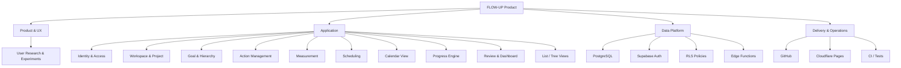

# Decomposition Map

```mermaid
flowchart TD
  P[FLOW-UP Product]
  P --> UX[Product & UX]
  P --> APP[Application]
  P --> DATA[Data Platform]
  P --> OPS[Delivery & Operations]

  APP --> ID[Identity & Access]
  APP --> PROJ[Workspace & Project]
  APP --> GOAL[Goal & Hierarchy]
  APP --> ACT[Action Management]
  APP --> MEAS[Measurement]
  APP --> SCH[Scheduling]
  APP --> CAL[Calendar View]
  APP --> PROG[Progress Engine]
  APP --> REV[Review & Dashboard]
  APP --> VIEWS[List / Tree Views]

  DATA --> DB[PostgreSQL]
  DATA --> AUTH[Supabase Auth]
  DATA --> RLS[RLS Policies]
  DATA --> EF[Edge Functions]

  OPS --> GIT[GitHub]
  OPS --> HOST[Cloudflare Pages]
  OPS --> TEST[CI / Tests]
  UX --> RESEARCH[User Research & Experiments]
```

This is a containment/decomposition view. Cross-module dependencies are documented separately in `DEPENDENCY_REGISTRY.md`.
